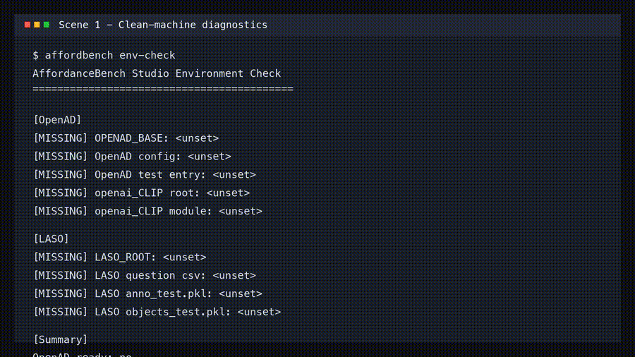
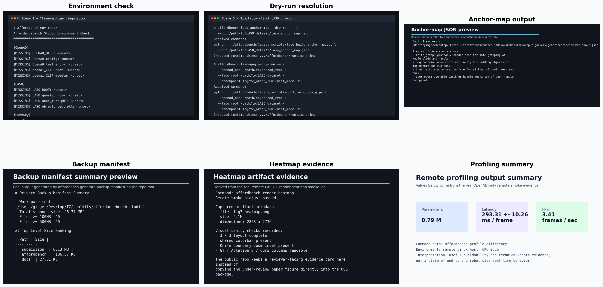

<div align="center">
  <h1>AffordanceBench Studio</h1>
  <p><strong>Open toolkit for query processing, evaluation, visualization, profiling, and reproducibility workflows in 3D multimedia affordance research.</strong></p>
  <p>
    <a href="https://github.com/Chilled-watermelon/affordancebench-studio/releases/tag/v0.1.2"></a>
    <a href="https://github.com/Chilled-watermelon/affordancebench-studio/actions/workflows/linux-smoke.yml"></a>
    <a href="./LICENSE"></a>
    
    <a href="https://github.com/Chilled-watermelon/affordancebench-studio/releases/download/v0.1.2/mm26_open_source_overview_paper_v1_20260410.pdf"></a>
    <a href="https://github.com/Chilled-watermelon/affordancebench-studio/archive/refs/tags/v0.1.2.zip"></a>
  </p>
  <p>
    <a href="#quickstart">Quickstart</a> •
    <a href="https://chilled-watermelon.github.io/affordancebench-studio/">Project Page</a> •
    <a href="#reviewer-friendly-path">Reviewer Path</a> •
    <a href="#command-families">Command Families</a> •
    <a href="#validation-evidence">Validation Evidence</a> •
    <a href="#documentation">Documentation</a>
  </p>
</div>

## What This Repository Is

AffordanceBench Studio turns scattered research scripts into a software-first package that is easier to build, inspect, demo, and extend. Instead of requiring users to navigate fragile private paths, ad hoc shell snippets, and benchmark-specific conventions, the toolkit exposes a unified CLI, command discovery, environment checks, evaluation helpers, visualization utilities, profiling entrypoints, and release-oriented reproducibility support.

This repository is positioned as an open software package, not as a second method paper. The public release is intentionally scoped toward buildability, compatibility, command discoverability, and review-friendly workflow packaging.

## Why It Is Reviewer-Friendly

| Need | What the toolkit provides |
| --- | --- |
| Fast first inspection | `affordbench list`, `affordbench describe <command>`, and `--dry-run` command resolution |
| Buildability | `pyproject.toml`, `requirements.txt`, `Dockerfile`, and an installable CLI entrypoint |
| Legacy compatibility | A public-facing CLI layered over packaged legacy Python and shell workflows |
| Environment safety | Explicit `OPENAD_BASE`, `LASO_ROOT`, `OPENAI_CLIP_ROOT`, and path resolution helpers |
| Compatibility on imperfect machines | `openai_CLIP` auto-discovery and a pure PyTorch `torch_cluster.fps` fallback for smoke validation |
| Public-safe release discipline | No bundled secrets, no large datasets, no under-review checkpoints, and no paper-facing final figures by default |

## Quickstart

```bash
pip install -r requirements.txt
pip install -e .

export OPENAD_BASE=/path/to/Open-Vocabulary-Affordance-Detection-in-3D-Point-Clouds-main
export LASO_ROOT=/path/to/LASO_dataset

affordbench env-check
affordbench list
affordbench describe laso-qaq
```

To run a minimal LASO-facing path:

```bash
affordbench laso-anchor-map -- --out "$LASO_ROOT/laso_anchor_map.json"

affordbench laso-qaq -- \
  --openad_base "$OPENAD_BASE" \
  --laso_root "$LASO_ROOT" \
  --checkpoint log/tc_prior_run1/best_model.t7
```

If you only have an OpenAD-style repository and want the lightest possible smoke path:

```bash
affordbench env-check -- --mode openad

affordbench profile-efficiency -- \
  --config config/openad_pn2/full_shape_cfg.py \
  --device cpu
```

## Reviewer-Friendly Path

For a quick third-party inspection, the recommended order is:

```bash
bash examples/demo_simulation_reviewer_walkthrough.sh
```

This path demonstrates:

1. environment validation before heavyweight execution
2. command discovery through a single public CLI
3. dry-run inspection of legacy-bridge resolution
4. both LASO-facing and OpenAD-only smoke entrypoints

If you want the exact screenshots and a lightweight silent demo clip used for reviewer-facing packaging:

```bash
bash submission/demo_assets/generate_simulation_demo_assets.sh
```



## Output Gallery

The repository now also includes a compact reviewer-facing gallery of software outputs and evidence cards:

```bash
/usr/bin/python3 submission/output_gallery/generate_output_gallery_assets.py
```



This gallery combines:

1. environment-check and dry-run inspection cards
2. a real anchor-map JSON preview generated through the CLI
3. a real sensitivity figure generated through the CLI
4. a real profiling summary derived from the remote smoke
5. a heatmap evidence card that proves figure generation without copying an under-review paper figure directly into the OSS package

## Command Families

| Family | Representative commands | Purpose |
| --- | --- | --- |
| Setup | `env-check`, `list`, `describe` | Validate environment, inspect command metadata, and resolve workflows before running them |
| Train | `train-tc`, `train-prompt` | Launch training-oriented legacy workflows through the same public CLI |
| Evaluation | `eval-risk`, `eval-ablation`, `eval-boundary`, `eval-interaction-proxy`, `macc-compare` | Run benchmark-style evaluation and comparison utilities |
| LASO | `laso-anchor-map`, `laso-qaq`, `laso-zeroshot`, `laso-translate`, `laso-eval-translated` | Support query-conditioned LASO workflows and prompt processing |
| Visualization | `render-heatmap`, `visualize-tsne`, `render-failure-cases`, `plot-sensitivity` | Export interpretable artifacts for inspection, demos, and reports |
| Profiling / Ops | `profile-efficiency`, `profile-stage-breakdown`, `generate-backup-manifest`, `package-backup-assets` | Measure efficiency and make release packaging easier |

## Validation Evidence

The repository already includes review-facing evidence instead of only raw scripts:

- public Linux smoke CI: `.github/workflows/linux-smoke.yml`
- local dry-run evidence: `submission/local_dry_run_evidence_20260411.md`
- remote OpenAD-only smoke evidence: `submission/remote_openad_smoke_evidence_20260411.md`
- remote LASO + render-heatmap smoke evidence: `submission/remote_laso_heatmap_smoke_evidence_20260411.md`
- public source-ZIP install evidence: `submission/source_zip_build_evidence_20260411.md`
- OpenReview public entry check: `submission/openreview_public_entry_check_20260411.md`
- PDF layout and page-count check: `submission/pdf_visual_check_20260411.md`

## Release Artifacts

- public project page: [AffordanceBench Studio](https://chilled-watermelon.github.io/affordancebench-studio/)
- public repository: [Chilled-watermelon/affordancebench-studio](https://github.com/Chilled-watermelon/affordancebench-studio)
- release page: [v0.1.2](https://github.com/Chilled-watermelon/affordancebench-studio/releases/tag/v0.1.2)
- source ZIP: [download v0.1.2](https://github.com/Chilled-watermelon/affordancebench-studio/archive/refs/tags/v0.1.2.zip)
- overview paper PDF: [release asset](https://github.com/Chilled-watermelon/affordancebench-studio/releases/download/v0.1.2/mm26_open_source_overview_paper_v1_20260410.pdf)

## Compatibility Notes

If `clip` is not installed from pip but exists in a local `openai_CLIP/` checkout, `affordbench` will try the following locations automatically:

- `$OPENAI_CLIP_ROOT`
- `$OPENAD_BASE/openai_CLIP`
- `$(dirname "$OPENAD_BASE")/openai_CLIP`
- `$(dirname "$(dirname "$OPENAD_BASE")")/openai_CLIP`

For reviewer machines that do not have `torch_cluster` prebuilt, the toolkit also includes a pure PyTorch fallback for `torch_cluster.fps`. It is meant for smoke validation and buildability checks rather than for replacing a full benchmark environment.

## What Is Not Bundled By Default

To keep the public package clean and safe to review, this release does not ship:

- large benchmark datasets
- under-review main-paper checkpoints
- paper-facing final figures from the under-review main submission
- secret-bearing config files or private service tokens

## Repository Layout

```text
affordancebench_studio/
├── affordbench/
│   ├── cli.py
│   ├── legacy.py
│   ├── paths.py
│   ├── legacy_scripts/
│   └── runtime_shims/
├── docs/
├── examples/
├── submission/
├── Dockerfile
├── pyproject.toml
└── requirements.txt
```

## Documentation

- quickstart: `docs/quickstart.md`
- project page: `docs/index.md`
- Pages-ready project page: `docs/index.html`
- deployed project page: `https://chilled-watermelon.github.io/affordancebench-studio/`
- architecture: `docs/architecture.md`
- command reference: `docs/command_reference.md`
- reproducibility notes: `docs/reproducibility.md`
- extending the bridge: `docs/extending_bridge.md`
- examples: `examples/README.md`
- submission package: `submission/README.md`
- output gallery: `submission/output_gallery/README.md`

## Current Status

This is still an early public release, but it already provides the layers that matter most for software review:

1. a standalone project identity
2. a unified CLI over a thicker legacy bridge
3. install, docs, and release metadata
4. smoke evidence for both OpenAD-only and LASO-facing paths
5. a public-safe packaging discipline for open-source release
